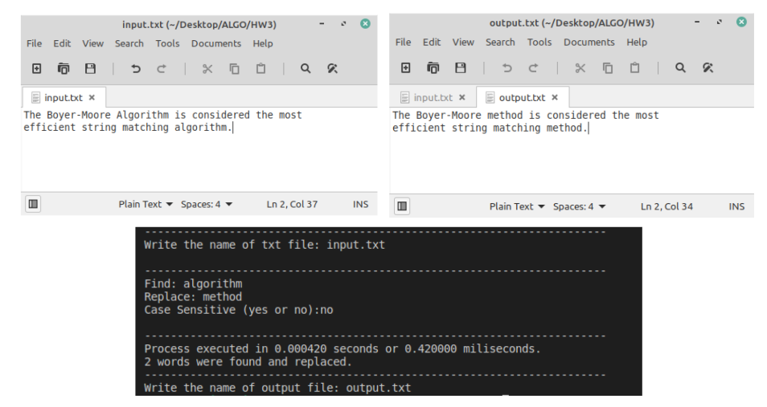
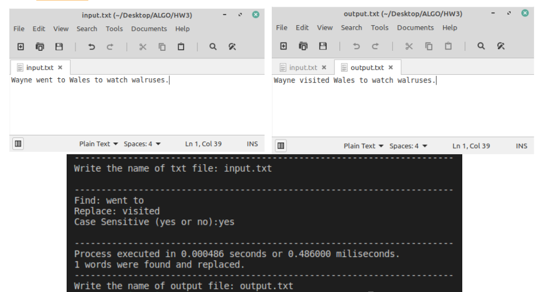
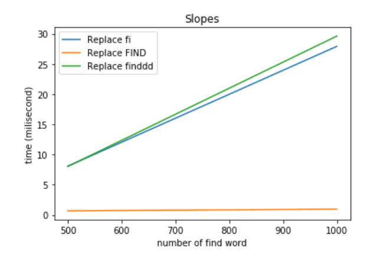

# Find-and-Replace
Classical find and replace ( ctrl + f ) application with C Programming Language
Boyer Moore algorithm was used with the search function.

## Example of GUI and how to work

## Performance on Huge Text Files
#### This figure explains how much time does it take while replacing given words with "find" word

